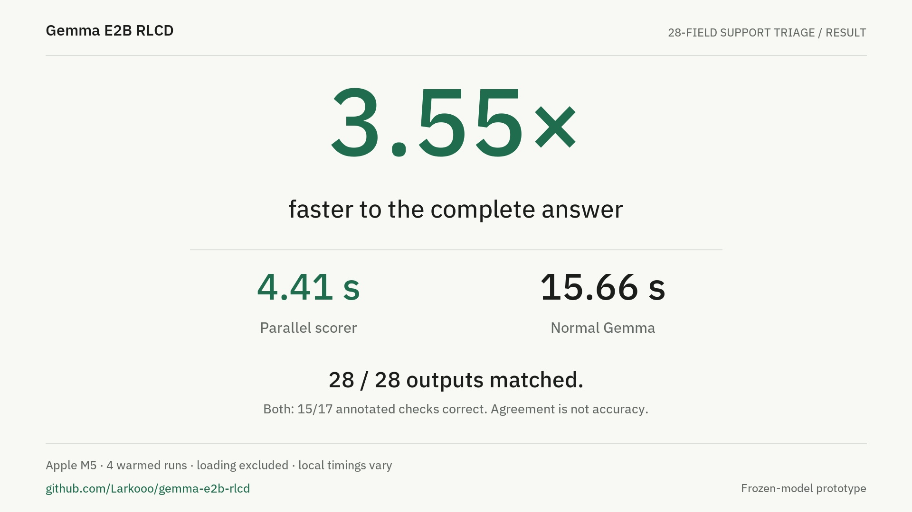
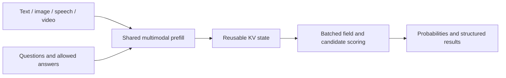

# Gemma E2B RLCD

Parallel classification, grading, and label probabilities over **text, images, speech, and video**, powered by Gemma 4 E2B on Apple Silicon.

Give the model one input and a set of questions. It encodes the input once, scores the allowed answers in GPU batches, and returns structured results with probability distributions.

[](docs/assets/demo.mp4)

**[Watch the demo](docs/assets/demo.mp4)** · 28 matching outputs · 4.41 s vs 15.66 s · 3.55× faster on the support-triage workload.

## Quick start

Requires an Apple Silicon Mac, Python 3.12+, [uv](https://docs.astral.sh/uv/getting-started/installation/), and ffmpeg for audio/video.

```bash
git clone https://github.com/Larkooo/gemma-e2b-rlcd.git
cd gemma-e2b-rlcd
uv venv --python 3.12
source .venv/bin/activate
uv pip install '.[dev,web]'
brew install ffmpeg

hf download mlx-community/gemma-4-e2b-it-4bit \
  --revision 238767527555cb75a05732a84dff5d6ba0dd6809 \
  --local-dir models/gemma-4-e2b-it-4bit

gemma-rlcd-web --model models/gemma-4-e2b-it-4bit --port 8787
```

Open **http://127.0.0.1:8787**. Add text, upload media, or record speech. Enter a question and its choices—**“Which brand is this?”** with **Porsche**, **Mercedes**, and **Other** is enough. Descriptions are optional.

Choose **Run all fields** for answers and distributions, or **Compare with Gemma** for a side-by-side comparison with ordinary JSON generation. Built-in examples cover support triage, customer inboxes, incident facts, and catalog routing. Uploads stay local and are deleted after each request.

Use the full [multimodal checkpoint](https://huggingface.co/mlx-community/gemma-4-e2b-it-4bit), including its audio encoder. Pass an existing local checkpoint to `--model` to skip the download.

### Live visual demo

Open **http://127.0.0.1:8787/demo** for 32, 64, or 128 checks over an image or video. Use the included street photo or upload your own media. The parallel scorer streams completed field batches; normal Gemma streams its generated JSON. Live clocks, per-check probabilities, answer differences, and downloadable events make the comparison inspectable. Both paths start together and stream side by side, sharing the resident weights with separate processors and KV caches. Timings measure concurrent completion on one GPU, including resource contention. The playground’s ordinary comparison remains sequential for isolated timings.

## How it works



1. **Encode once.** Gemma processes the complete input, questions, and candidate descriptions in one shared prefix.
2. **Branch by field.** Each field starts from that prefix with its own short JSON key. Branches run in bounded GPU batches.
3. **Score complete answers.** Single-token choices share one output vector. Multi-token choices are evaluated as complete JSON values with teacher forcing, including closing quotes.
4. **Return the result.** Candidate log likelihoods become probabilities within each field. Code selects labels, calculates grades, and assembles the final JSON.

The output values are known in advance, so inference can score them without an autoregressive answer-generation loop. All 35 Gemma layers and the native image/audio processing remain in use. Video includes sampled frames, timestamps, and its soundtrack.

The default batch size is eight. More fields use additional batches; prefix computation is reused, while KV storage is replicated per batch row. Fields share the complete input and schema, but do not condition on one another's generated answers. See [architecture](docs/architecture.md) for the scoring equations, precision settings, and execution details.

### RLCD and probability learning

**RLCD** stands for **Reinforcement Learning for Calibrated Decisions**: learning decision probabilities from outcome feedback. A calibrated 80% prediction should succeed about 80% of the time across comparable cases.

Here, the default inference path obtains candidate probabilities directly from pretrained Gemma. The repository also includes a candidate-conditioned decision head, supervised likelihood training, Brier/log-loss evaluation, and temperature fitting. [Training and calibration](docs/training.md) explains these components and the outcome-feedback objective separately from inference.

## Output types

| Type | Question | Result |
| --- | --- | --- |
| `Choice` | Which brand is this? | One choice and a distribution summing to 1 |
| `Independent` | Which animals are present? | A separate yes probability for each label |
| `Score` | How well does this meet the rubric? | Level probabilities and an expected grade |
| `Noul` | Does this need escalation? | A yes/no probability |

For independent labels, `{cat: 0.9, dog: 0.5}` is valid: both can be present. A mutually exclusive cat-or-dog choice sums to 1. Scores use zero-based grade levels; `confidence` measures distribution concentration via normalized entropy. Probability quality can be evaluated with the [calibration utilities](gemma_rlcd/calibration.py).

```python
from gemma_rlcd import Choice, DecisionEngine, Independent, State
from gemma_rlcd.json_backend import JSONMLXBackend

engine = DecisionEngine(JSONMLXBackend("models/gemma-4-e2b-it-4bit"))
result = engine.system_one(
    State(text="A cat sleeps on the sofa. No dogs are present."),
    {
        "animal": Choice("Which animal is present?", {"cat": "cat", "dog": "dog"}),
        "presence": Independent(
            "Which animals are present?",
            {"cat": "A cat is present", "dog": "A dog is present"},
        ),
    },
)
print(result["answers"])
```

`State` also accepts `images`, `audio`, and `videos` as tuples of local paths. Run a JSON request from the command line with:

```bash
gemma-rlcd examples/text.json --model models/gemma-4-e2b-it-4bit
```

## Performance

Local Apple M5 measurements: the same 4-bit model, four measured runs after warmup, fresh KV state per request. Times include input preparation and inference; model loading and upload are excluded.

| Workload | Parallel | Normal Gemma | Speed ratio | Annotated answers, parallel / normal |
| --- | ---: | ---: | ---: | --- |
| Support triage · 28 fields | 4.41 s | 15.66 s | **3.55×** | 15/17 · 15/17 |
| Customer inbox · 32 decisions | 5.24 s | 13.97 s | **2.67×** | 31/32 · 32/32 |
| Incident facts · 32 labels | 0.86 s | 5.95 s | **6.88×** | 31/32 · 32/32 |
| Catalog routing · 64 choices | 3.27 s | 2.46 s | **0.75×** | 1/1 · 1/1 |

A ratio above 1 favors parallel scoring. The support example matches all 28 outputs; 17 have annotated expectations. Many short decisions benefit most, while long candidate sets add scoring work. The [full comparison](docs/experiments/demo-workloads.md) includes all workloads, timing ranges, answer differences, and a serial scoring control. The demo replays these measured support-case medians.

## Media and request limits

The playground accepts up to eight images, one audio source, and one video, with 200 MB of uploads per request. Audio and videos with sound support up to 30 seconds; silent video supports up to 60 seconds. Video targets one frame per second, capped at 32 frames, so brief events can fall between samples.

Requests support up to 32 named fields, 128 primitive decisions, and 8,192 processed input tokens. Oversized inputs return an error rather than being truncated. Multi-picture phone JPEGs use the full-resolution primary photograph. Text and field definitions are saved in browser local storage; uploaded media is not retained.

## Development

```bash
python -m pytest -q
ruff check gemma_rlcd tests scripts
ruff format --check gemma_rlcd tests scripts
node --check gemma_rlcd/static/app.js
```

See [contributing](CONTRIBUTING.md), [training](docs/training.md), and [experiment reports](reports/README.md). The [tested dependencies](requirements-tested.txt) and [model revision](model-source.json) make the local setup reproducible. CI runs portable tests on Linux; MLX inference and GPU tests run on Apple Silicon.

## License

Code and original synthetic examples: [MIT](LICENSE). Model weights retain their [upstream terms](https://huggingface.co/google/gemma-4-E2B-it). Third-party code and adapted examples are documented in [notices](THIRD_PARTY_NOTICES.md).
