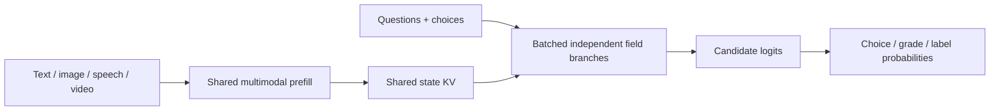

# Gemma E2B RLCD

Multimodal typed decisions with Gemma 4 E2B on Apple Silicon: give it text, an image, speech, or video, ask a question, and get choices, grades, or independent-label probabilities.

**Current status:** a working frozen-model scorer, a local web playground, and experimental supervised decision-head training. Reinforcement Learning for Calibrated Decisions (RLCD) is the research direction; an RL training loop is **not implemented**, and probabilities are **not calibrated**. This is an independent project inspired by [TypeSafe's Jev and RLCD description](https://typesafe.ai/blog/introducing-system-one-models-and-jev), not a reproduction of its architecture or training method.

## Try it

Requires an Apple Silicon Mac, Python 3.12+, [uv](https://docs.astral.sh/uv/getting-started/installation/), and ffmpeg/ffprobe for audio or video. Local development was tested on an Apple M5 with 32 GB unified memory. Model inference uses MLX; this release does not provide a CUDA backend.

```bash
git clone https://github.com/Larkooo/gemma-e2b-rlcd.git
cd gemma-e2b-rlcd
uv venv --python 3.12
source .venv/bin/activate
uv pip install '.[dev,web]'
brew install ffmpeg

hf download mlx-community/gemma-4-e2b-it-4bit \
  --revision 238767527555cb75a05732a84dff5d6ba0dd6809 \
  --local-dir models/gemma-4-e2b-it-4bit

gemma-decide-web --model models/gemma-4-e2b-it-4bit --port 8787
```

Open **http://127.0.0.1:8787**. Weights are downloaded separately from [MLX Community](https://huggingface.co/mlx-community/gemma-4-e2b-it-4bit); use the full multimodal checkpoint, including its audio encoder. An existing local copy can be passed to `--model` instead.

1. Add text, media, or a speech recording.
2. Enter a question, such as **“Which brand is this?”**
3. Add choices such as **Porsche**, **Mercedes**, and **Other**. Descriptions are optional. For grading, choose a numeric scale; level descriptions are also optional in the UI.
4. Click **Run all fields**, or **Compare with Gemma** to see both answers and elapsed times.

The comparison runs the parallel scorer once, then ordinary autoregressive Gemma once, on the same resident model and media settings. Normal Gemma generates one compact JSON object for all fields. The UI shows disagreements, malformed answers, generated token counts, and the speed ratio when the generated answer is valid. The Answers tab retains the scorer's full distributions.

Timings include input preparation and inference, exclude model loading and upload transfer, and add shared upload decoding equally to each path. These are single observations, without additional warm-up or benchmark runs. Order and first-use effects can influence timing. Agreement is not evidence of accuracy.

Uploads stay local and are deleted after the request. Text and field definitions are saved in browser local storage; attachments are not retained. Multi-picture phone JPEGs use the full-resolution primary photograph.

## Output contracts

| Type | Use | Result |
| --- | --- | --- |
| `Choice` | Select one category | Winner and probabilities summing to 1 |
| `Independent` | Check each label separately | A yes probability per label; multiple labels can be true |
| `Score` | Grade on ordered levels | Level probabilities and their probability-weighted mean |
| `Noul` | Evaluate a yes/no proposition | Probability that the proposition is true |

For example, `{cat: 0.9, dog: 0.5}` makes sense for independent animal-presence labels. A single exclusive cat-versus-dog choice must sum to 1. Grades use zero-based level indices, not a probability of correctness. The `confidence` statistic is one minus normalized entropy; it measures distribution concentration.

The web UI accepts names alone. The Python API makes meanings explicit with a name-to-description mapping; use the name itself when no additional description is needed:

```python
from gemma_decisions import Choice, DecisionEngine, Independent, State
from gemma_decisions.cached_backend import CachedMLXBackend

engine = DecisionEngine(CachedMLXBackend("models/gemma-4-e2b-it-4bit"))
result = engine.system_one(
    State(text="A cat sleeps on the sofa. No dogs are present."),
    {
        "animal": Choice("Which animal is present?", {"cat": "cat", "dog": "dog"}),
        "presence": Independent(
            "Which animals are present?",
            {"cat": "A cat is present", "dog": "A dog is present"},
        ),
    },
)
print(result["answers"])
```

`State` also accepts `images`, `audio`, and `videos` as tuples of local paths. To run a JSON request from the command line:

```bash
gemma-decide examples/text.json --model models/gemma-4-e2b-it-4bit
```

## How parallel scoring works



The default path keeps all 35 Gemma layers. It computes the common state once, then evaluates field suffixes in GPU batches, reading candidate logits directly. It does not generate answer text or JSON token by token. The final 20 KV-sharing layers compute only the requested answer position; earlier layers still process every question token. Image position lookup also avoids a dense one-hot multiplication.

All candidates in a Choice are read from one output vector, not separate full-model passes. Independent labels expand into binary fields. Batches default to eight fields; larger requests use successive batches. KV computation is shared, while KV storage is currently replicated across batch rows. Two fields do not guarantee a 2× end-to-end speedup. See [architecture and precision details](docs/architecture.md).

## Input limits

- Web uploads: up to eight images, one audio clip, and one video; 200 MB combined.
- Audio: up to 30 seconds. A video's soundtrack is included automatically; a second audio source is rejected.
- Silent video: up to 60 seconds; video with audio: up to 30 seconds.
- Video sampling: target 1 frame/second, capped at 32 frames by the verified processor. Brief visual events can be missed.
- Input limit: 8,192 processed tokens. Oversized requests fail instead of silently truncating.
- Web outputs: up to 32 named fields and 64 primitive decisions after independent-label expansion.

The original model's perception settings remain in use. This does not imply lossless processing of every image pixel or video frame.

## Research and results

The default frozen scorer remains the reference. Two supervised decision-head pilots performed worse and are not recommended for inference:

| Text pilot | Correct decisions on the small test set |
| --- | ---: |
| Frozen Gemma scorer | 64/64 |
| Four-layer state encoder + trained head | 21/64 |
| Full 35-layer state encoder + trained head | 23/64 |

These are narrow synthetic experiments, not general quality benchmarks. No trained multimodal accuracy improvement, calibration result, or RL advantage has been established. The rejected pilot metadata and reports are retained; weights are not distributed.

- [Training implementation, failed pilots, and RLCD research plan](docs/training.md)
- [Full-detail execution results](docs/experiments/full-detail.md)
- [Two-field video comparison](docs/experiments/two-fields.md)
- [Raw reports and provenance](reports/README.md)

## Development

```bash
python -m pytest -q
ruff check gemma_decisions tests scripts
ruff format --check gemma_decisions tests scripts
node --check gemma_decisions/static/app.js
```

The GitHub workflow runs portable contract and web tests on Linux without model weights; MLX-only tests skip there. GPU tests and inference require Apple Silicon. [Contributing](CONTRIBUTING.md) explains the validation boundaries. The pinned MLX-VLM version matters because the optimized path uses its Gemma internals. [requirements-tested.txt](requirements-tested.txt) records the local development environment.

For synthetic multimodal integration fixtures on macOS:

```bash
python scripts/create_fixtures.py --output-dir work/media
python scripts/smoke.py --model models/gemma-4-e2b-it-4bit \
  --media work/media --report work/smoke.json
```

## License

Project code and synthetic examples are available under [MIT](LICENSE). Model weights are not included and retain their upstream terms. See [third-party notices](THIRD_PARTY_NOTICES.md), the [Google model card](https://huggingface.co/google/gemma-4-E2B-it), and the [MLX conversion](https://huggingface.co/mlx-community/gemma-4-e2b-it-4bit).
